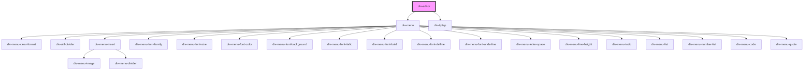

# div-editor

<!-- Auto Generated Below -->

## Properties

| Property     | Attribute | Description | Type    | Default |
| ------------ | --------- | ----------- | ------- | ------- |
| `extensions` | --        |             | `any[]` | `[]`    |

## Events

| Event        | Description | Type                  |
| ------------ | ----------- | --------------------- |
| `editorInit` |             | `CustomEvent<Editor>` |

## Dependencies

### Depends on

- [div-menu](../div-menu)
- [div-tiptap](../div-tiptap)

### Graph

----------------------------------------------

*Built with love!*
