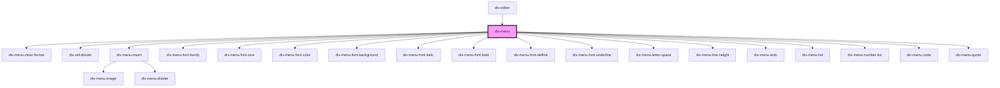

# div-menu

<!-- Auto Generated Below -->

## Properties

| Property | Attribute | Description | Type     | Default     |
| -------- | --------- | ----------- | -------- | ----------- |
| `editor` | --        |             | `Editor` | `undefined` |

## Dependencies

### Used by

 - [div-editor](../div-editor)

### Depends on

- [div-menu-clear-format](../menu/clear-format)
- [div-util-divider](../util-component/divider)
- [div-menu-insert](../menu/insert)
- [div-menu-font-family](../menu/font-family)
- [div-menu-font-size](../menu/font-size)
- [div-menu-font-color](../menu/font-color)
- [div-menu-font-background](../menu/font-background)
- [div-menu-font-italic](../menu/font-italic)
- [div-menu-font-bold](../menu/font-bold)
- [div-menu-font-delline](../menu/font-delline)
- [div-menu-font-underline](../menu/font-underline)
- [div-menu-letter-space](../menu/letter-space)
- [div-menu-line-height](../menu/line-height)
- [div-menu-todo](../menu/todo)
- [div-menu-list](../menu/list)
- [div-menu-number-list](../menu/number-list)
- [div-menu-code](../menu/code)
- [div-menu-quote](../menu/quote)

### Graph

----------------------------------------------

*Built with love!*
