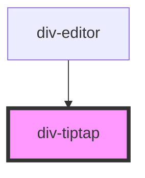

# div-tiptap

<!-- Auto Generated Below -->

## Properties

| Property     | Attribute | Description | Type     | Default     |
| ------------ | --------- | ----------- | -------- | ----------- |
| `extensions` | --        |             | `any[]`  | `[]`        |
| `height`     | `height`  |             | `string` | `undefined` |

## Events

| Event        | Description | Type                  |
| ------------ | ----------- | --------------------- |
| `editorInit` |             | `CustomEvent<Editor>` |

## Dependencies

### Used by

 - [div-editor](../div-editor)

### Graph

----------------------------------------------

*Built with love!*
