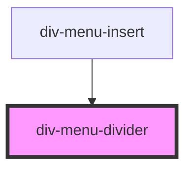

# div-menu-table

<!-- Auto Generated Below -->

## Properties

| Property | Attribute | Description | Type     | Default     |
| -------- | --------- | ----------- | -------- | ----------- |
| `editor` | --        |             | `Editor` | `undefined` |

## Dependencies

### Used by

 - [div-menu-insert](../insert)

### Graph

----------------------------------------------

*Built with love!*
